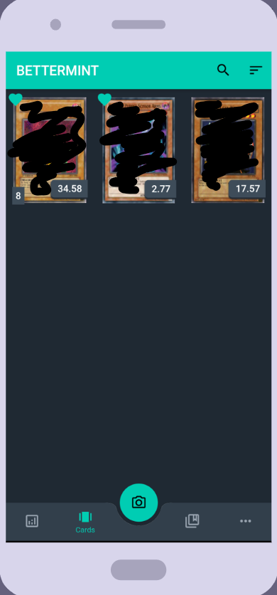
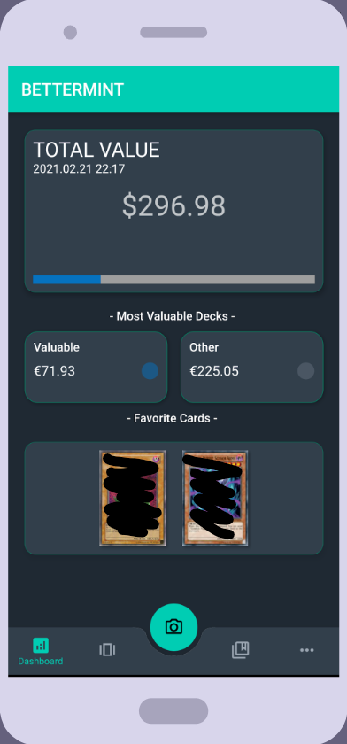
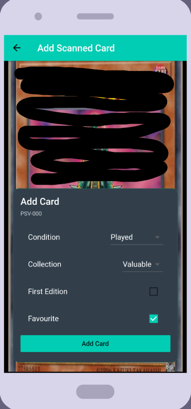
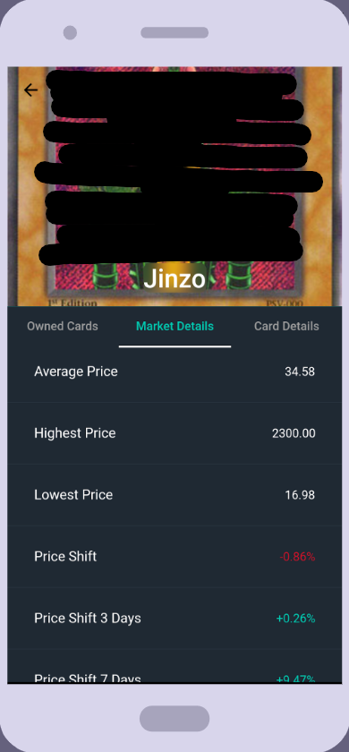
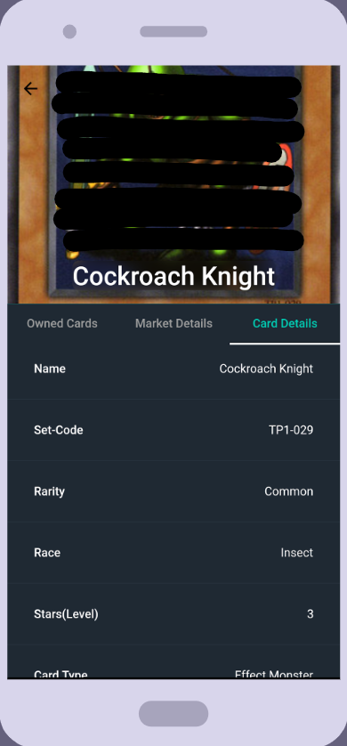

BetterMint
===

BetterMint is a mobile application based on Flutter. 
The aim of the application is to help card collectors to:
-  Organize their card collections 
-  Simplify tedious research of card prices
-  Digitize card collections via camera
-  Create and organize card collections
-  Offer an overview of card prices

 